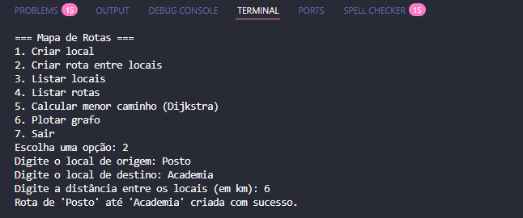
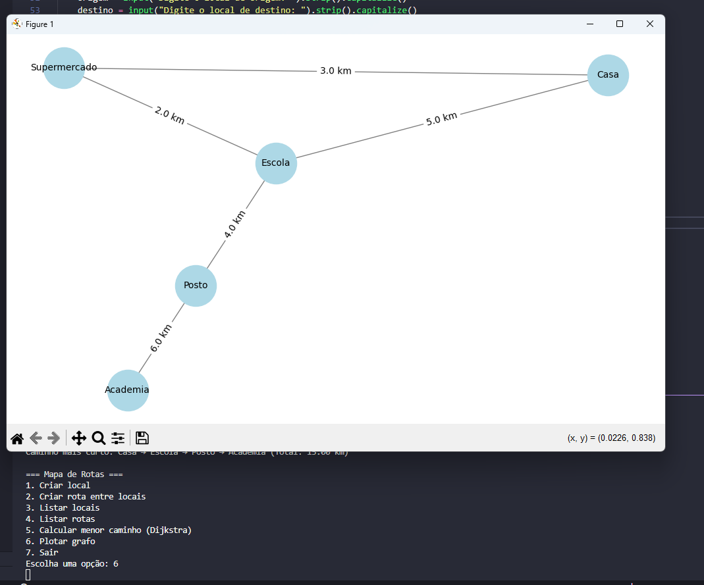
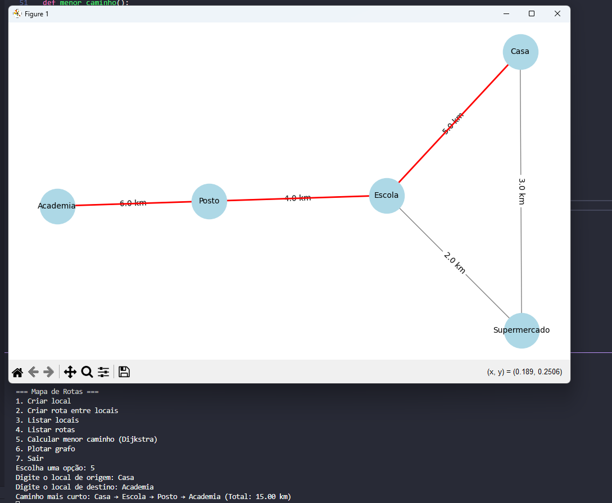

# Grafos2_Rotina

<!-- **Número da Lista**: X<br> -->
**Conteúdo da Disciplina**: Grafos2<br>

## Alunos
|Matrícula | Aluno |
| -- | -- |
| 18/0015311  |  Danilo Domingo Vitoriano Silva |
| 20/0058576  |  Joao Victor Marques Reis de Miranda |

## Sobre 
Este projeto implementa um sistema de calcula qual é a melhor rota para fazer mais atividades e percorrer o menor caminho.

### Objetivo
Criar um sistema onde locais são representados como vértices e as rotas entre eles como arestas com pesos (distância, tempo ou custo). O algoritmo de Dijkstra será usado para calcular o caminho mais curto entre dois pontos.

### Funcionalidades
- Cadastrar locais (vértices do grafo)
- Cadastrar rotas entre os locais com pesos (distância em km, por exemplo)
- Exibir todos os locais e rotas
- Buscar o caminho mais curto entre dois locais usando o algoritmo de Dijkstra
- Visualizar graficamente o grafo com destaque para o caminho mais curto (arestas coloridas diferentes)
- Salvar e carregar mapas personalizados (extra, se quiser persistência)

## Screenshots

<div align="center">
  <p><b>Menu Principal</b></p>
  
</div>

<div align="center">
  <p><b>Visualização do Grafo</b></p>
  
</div>

<div align="center">
  <p><b>Cálculo do Menor Caminho</b></p>
  
</div>

## Instalação 
**Linguagem**: Python<br>

Foi utilizado o **Python 3.13**, juntamente com os bibliotecas **networkx** e **matplotlib**

Para instalar as bibliotecas utilize:

    pip install -r requirements.txt


## Uso 

O sistema permite que você crie um mapa de rotas com locais e conexões entre eles, além de calcular o melhor caminho entre dois pontos usando o algoritmo de Dijkstra.

### Funcionalidades Detalhadas

1. **Criar Local (`criar_local`)**
   - Adiciona um novo ponto ao mapa
   - Cada local é tratado como um vértice no grafo
   - Os nomes são automaticamente capitalizados para evitar duplicações

2. **Criar Rota (`criar_rota`)**
   - Estabelece uma conexão entre dois locais existentes
   - Define a distância em quilômetros entre os dois pontos
   - Cria uma aresta ponderada no grafo

3. **Listar Locais (`listar_locais`)**
   - Exibe todos os locais (vértices) cadastrados no sistema
   - Apresenta os nomes em ordem alfabética

4. **Listar Rotas (`listar_rotas`)**
   - Mostra todas as conexões entre locais com suas respectivas distâncias
   - Exibe as rotas no formato: Origem ↔ Destino (X km)

5. **Calcular Menor Caminho (`menor_caminho`)**
   - Utiliza o algoritmo de Dijkstra para encontrar o caminho mais curto entre dois pontos
   - Calcula a distância total do percurso
   - Exibe o resultado visualmente com as rotas do caminho destacadas em vermelho

6. **Plotar Grafo (`plotar_grafo`)**
   - Gera uma representação visual do mapa com todos os locais e rotas
   - Os locais são representados por círculos azul-claros
   - As distâncias são exibidas nas linhas de conexão
   - Caminhos calculados pelo Dijkstra são destacados em vermelho

### Exemplo de Uso

1. Execute o programa:
   ```
   python main.py
   ```

2. Cadastre locais (opção 1):
   - Casa
   - Trabalho
   - Academia
   - Supermercado

3. Cadastre rotas entre os locais (opção 2):
   - Casa → Trabalho: 5.0 km
   - Casa → Academia: 2.5 km
   - Academia → Supermercado: 1.8 km
   - Trabalho → Supermercado: 3.2 km

4. Calcule o menor caminho (opção 5):
   - De: Casa
   - Para: Supermercado

O sistema calculará e exibirá o caminho mais curto (Casa → Academia → Supermercado, total de 4.3 km) e mostrará graficamente o mapa com este caminho destacado em vermelho.
## Vídeo

Video de Apresentação do projeto:

<div align="center">
  <!-- <p><a href="./assets/Trabalho_de_PA_Grafo1.mp4">Vídeo de Apresentação</a></p> -->
  <p><a href="">Apresentação no YouTube</a></p>
</div>
